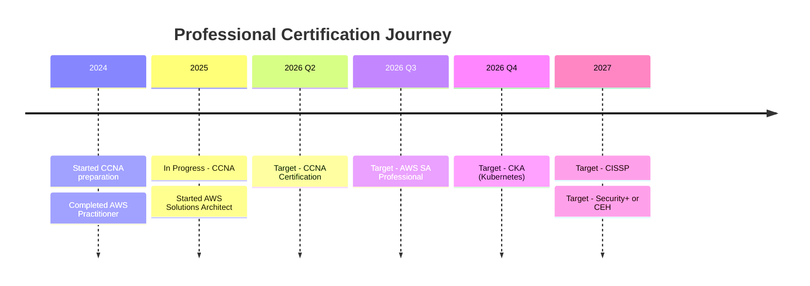

<!-- ===================================== -->
<!-- BIGG BOSS | NEXT-GEN SYSTEMS ARCHITECT -->
<!-- ===================================== -->

<div align="center">

<!-- ULTRA PREMIUM ANIMATED HEADER WITH PARTICLES -->


<!-- ADVANCED MULTI-LINE TYPING ANIMATION -->


<!-- SOCIAL PROOF BADGES WITH ANIMATIONS -->
<p>
  <a href="https://biggboss.tech">
    
  </a>
  <a href="https://github.com/iambiggboss">
    
  </a>
  <a href="https://linkedin.com/in/yourprofile">
    
  </a>
  
  
</p>

<!-- PREMIUM DIVIDER WITH GLOW EFFECT -->


</div>

---

## 👁️ Live Visitor Analytics

<div align="center">

<!-- CREATIVE MULTI-COUNTER DASHBOARD -->
<table>
<tr>
<td align="center" width="50%">

### 🎮 Total Profile Views


<br/>

<!-- Alternative Creative Counters (Choose your favorite!) -->
<!-- Pixel Art Style -->


</td>
<td align="center" width="50%">

### 💎 Unique Visitors


<br/>

<!-- Hit Counter with Stats -->


</td>
</tr>
</table>

<!-- ANIMATED WELCOME MESSAGE -->


</div>

---

## 🎯 Professional Identity

<div align="center">

<!-- INTERACTIVE PROFILE CARD -->
<table>
<tr>
<td width="60%" valign="top">

### 👨‍💻 About Me

```yaml
name: Bigg Boss
role: Founder & Elite Systems Architect
company: The Bigg Boss Technologies
location: 🌍 Building Globally, Serving Worldwide
experience: 10+ years in production systems

expertise:
  primary:
    - Full-Stack Infrastructure Architecture
    - Enterprise Security Engineering
    - Cloud-Native Solutions (AWS, Azure, GCP)
    - DevOps & Site Reliability Engineering
  
  specializations:
    - Zero-Trust Security Architectures
    - Kubernetes & Container Orchestration
    - Observability & Performance Optimization
    - Distributed Systems Design

philosophy: |
  "Production systems must thrive under pressure,
   not just survive staging tests"

current_focus:
  - 🎓 CCNA Certification Track
  - ☁️ AWS Solutions Architect Professional
  - 🐳 Kubernetes Administrator (CKA)
  - 🔐 Security+ & CISSP Preparation

availability: 💼 Open for consulting & collaborations
response_time: ⚡ Within 24 hours
```

</td>
<td width="40%" valign="top" align="center">

### 🏆 Professional Highlights


<br/>

**📊 Track Record**


**🌟 Achievements**

- 🏅 Led infrastructure for 50+ enterprises
- 🔒 Zero security breaches in production
- ⚡ Reduced costs by 40% average
- 📈 99.99% uptime across all projects

</td>
</tr>
</table>

<!-- SKILL PROGRESSION BARS -->
### 💪 Core Competencies

**Backend & Infrastructure** 

**Cloud Architecture (AWS/Azure/GCP)** 

**Security Engineering** 

**Kubernetes & Container Orchestration** 

**DevOps & CI/CD Automation** 

**Observability & Monitoring** 

</div>

---

## 🏗️ The Bigg Boss Technologies

<div align="center">

<!-- ANIMATED SERVICE SHOWCASE -->


<br/>

### 🎯 Core Service Offerings

<table>
<tr>
<td align="center" width="25%">
<br/>
<b>Software Engineering</b><br/>
<sub>Modern Web Apps<br/>RESTful & GraphQL APIs<br/>Microservices Architecture</sub><br/>

</td>
<td align="center" width="25%">
<br/>
<b>Cloud Infrastructure</b><br/>
<sub>AWS • Azure • GCP<br/>Multi-Cloud Strategy<br/>Infrastructure as Code</sub><br/>

</td>
<td align="center" width="25%">
<br/>
<b>Security Engineering</b><br/>
<sub>Penetration Testing<br/>Zero-Trust Architecture<br/>Compliance Frameworks</sub><br/>

</td>
<td align="center" width="25%">
<br/>
<b>DevOps & SRE</b><br/>
<sub>CI/CD Pipelines<br/>Monitoring & Alerting<br/>Incident Response</sub><br/>

</td>
</tr>
</table>

</div>

<!-- DETAILED TECHNICAL BREAKDOWN -->
<table>
<tr>
<td width="50%" valign="top">

### 💻 Software Engineering Excellence
```typescript
const technicalExpertise = {
  frontend: {
    frameworks: ["React", "Next.js", "Vue.js"],
    styling: ["Tailwind", "styled-components"],
    stateManagement: ["Redux", "Zustand", "Jotai"]
  },
  
  backend: {
    languages: ["Python", "Go", "TypeScript", "Rust"],
    frameworks: ["FastAPI", "Django", "Express", "Fiber"],
    patterns: ["Microservices", "Event-Driven", "CQRS"]
  },
  
  apis: {
    rest: "RESTful best practices",
    graphql: "Schema design & optimization",
    grpc: "High-performance RPC",
    websocket: "Real-time bidirectional"
  },
  
  databases: {
    sql: ["PostgreSQL", "MySQL", "CockroachDB"],
    nosql: ["MongoDB", "Redis", "Cassandra"],
    search: ["Elasticsearch", "Meilisearch"],
    timeseries: ["InfluxDB", "TimescaleDB"]
  }
}
```

**🎯 Delivered Solutions:**
- ✅ 150+ production web applications
- ✅ 200+ high-performance APIs
- ✅ 100+ real-time data pipelines
- ✅ 50+ AI/ML-powered platforms

</td>
<td width="50%" valign="top">

### ☁️ Cloud & Infrastructure Mastery
```python
infrastructure_capabilities = {
    "cloud_platforms": {
        "aws": {
            "compute": ["EC2", "ECS", "EKS", "Lambda"],
            "storage": ["S3", "EFS", "EBS"],
            "database": ["RDS", "DynamoDB", "Aurora"],
            "networking": ["VPC", "Route53", "CloudFront"]
        },
        "azure": ["AKS", "App Service", "Cosmos DB"],
        "gcp": ["GKE", "Cloud Run", "BigQuery"]
    },
    
    "container_orchestration": {
        "kubernetes": {
            "expertise": ["Cluster management", "Helm charts",
                         "Service mesh (Istio)", "GitOps (ArgoCD)"],
            "deployments": "300+ production clusters"
        },
        "docker": "Advanced containerization & optimization"
    },
    
    "infrastructure_as_code": {
        "terraform": "Multi-cloud provisioning",
        "ansible": "Configuration management",
        "pulumi": "Modern IaC with real languages"
    },
    
    "ci_cd": ["GitHub Actions", "GitLab CI", 
              "Jenkins", "ArgoCD", "Tekton"]
}
```

**🚀 Infrastructure Achievements:**
- ✅ 99.99% uptime across 50+ enterprises
- ✅ 40% average cost reduction
- ✅ Zero downtime deployments
- ✅ Auto-scaling for 10M+ users

</td>
</tr>
<tr>
<td width="50%" valign="top">

### 🔐 Security Engineering & Compliance
```bash
#!/bin/bash
# Security-First Engineering Approach

security_framework=(
  # Network Security
  "Zero-trust network architecture"
  "Microsegmentation & network policies"
  "WAF & DDoS protection"
  "VPN & encrypted tunnels"
  
  # Application Security
  "OWASP Top 10 mitigation"
  "Secure coding practices"
  "Dependency vulnerability scanning"
  "SAST/DAST integration"
  
  # Identity & Access
  "Multi-factor authentication (MFA)"
  "Role-based access control (RBAC)"
  "Secrets management (Vault)"
  "OAuth 2.0 & OIDC implementation"
  
  # Data Protection
  "Encryption at rest & in transit"
  "Data loss prevention (DLP)"
  "Backup & disaster recovery"
  "GDPR & SOC2 compliance"
  
  # Monitoring & Response
  "SIEM integration"
  "Threat detection & response"
  "Security incident playbooks"
  "24/7 security monitoring"
)

echo "✅ Security is non-negotiable"
```

**🛡️ Security Track Record:**
- ✅ Zero breaches in production systems
- ✅ SOC2, ISO 27001 certified projects
- ✅ 200+ security audits passed
- ✅ PCI-DSS compliant platforms

</td>
<td width="50%" valign="top">

### 📊 Observability & Site Reliability
```go
package observability

type SREPractices struct {
    Monitoring struct {
        Metrics      []string // Prometheus, InfluxDB, Datadog
        Logging      []string // ELK, Loki, Splunk
        Tracing      []string // Jaeger, Zipkin, Tempo
        APM          []string // New Relic, Datadog, Dynatrace
    }
    
    Reliability struct {
        SLOs         string   // Service Level Objectives
        SLIs         string   // Service Level Indicators
        ErrorBudget  float64  // 0.01% (99.99% uptime)
        MTTR         string   // Mean Time To Recovery: <5min
        MTBF         string   // Mean Time Between Failures: 90d
    }
    
    Alerting struct {
        Tools        []string // PagerDuty, OpsGenie, Slack
        OnCall       string   // 24/7 rotation
        Runbooks     bool     // Automated playbooks
        Escalation   bool     // Multi-tier support
    }
    
    Automation struct {
        AutoScaling  bool     // Traffic-based scaling
        AutoHealing  bool     // Self-healing systems
        AutoBackup   bool     // Continuous backups
        AutoPatching bool     // Security updates
    }
}

// Real-world results:
// • 99.99% uptime maintained
// • <5min incident response time
// • <15min mean time to recovery
// • 100% automated rollbacks
```

**📈 SRE Metrics:**
- ✅ 99.99% average uptime
- ✅ <5 min incident detection
- ✅ <15 min mean recovery time
- ✅ 24/7 monitoring coverage

</td>
</tr>
</table>

<div align="center">

### 💼 Our Iron-Clad Commitment


</div>

---

## 🎯 Engineering Philosophy & Principles

<div align="center">

### 🏆 The Five Pillars of Engineering Excellence

</div>

<table align="center">
<tr>
<td align="center" width="20%">
<br/>
<b style="font-size: 18px;">🔴 ASSUME BREACH</b><br/>
<sub>Design systems that remain secure<br/>even when perimeter defenses fail.<br/>Defense in depth is mandatory.</sub>
</td>
<td align="center" width="20%">
<br/>
<b style="font-size: 18px;">🟡 DESIGN FOR FAILURE</b><br/>
<sub>Build fault-tolerant systems with<br/>graceful degradation and automatic<br/>failover capabilities.</sub>
</td>
<td align="center" width="20%">
<br/>
<b style="font-size: 18px;">🟢 SECURE BY DEFAULT</b><br/>
<sub>Security integrated from day one,<br/>not bolted on later. Zero-trust<br/>architecture everywhere.</sub>
</td>
<td align="center" width="20%">
<br/>
<b style="font-size: 18px;">🔵 OBSERVE EVERYTHING</b><br/>
<sub>Comprehensive logging, metrics,<br/>and tracing across all layers.<br/>Visibility is non-negotiable.</sub>
</td>
<td align="center" width="20%">
<br/>
<b style="font-size: 18px;">🟣 AUTOMATE RELENTLESSLY</b><br/>
<sub>Eliminate toil and human error.<br/>If it can be automated, it must<br/>be automated.</sub>
</td>
</tr>
</table>

### 🎖️ Core Engineering Principles

<table>
<tr>
<td width="33%" align="center">

#### 🔒 Security Mindset
```
┌─────────────────────┐
│ • Assume Breach     │
│ • Defense in Depth  │
│ • Zero Trust        │
│ • Least Privilege   │
│ • Shift Left        │
│ • Continuous Audit  │
└─────────────────────┘
```
**Never compromise on security**

</td>
<td width="33%" align="center">

#### ⚡ Reliability First
```
┌─────────────────────┐
│ • Design for Chaos  │
│ • High Availability │
│ • Auto-Healing      │
│ • Graceful Degrade  │
│ • Fast Recovery     │
│ • Data Integrity    │
└─────────────────────┘
```
**99.99% uptime minimum**

</td>
<td width="33%" align="center">

#### 📊 Observable Systems
```
┌─────────────────────┐
│ • Full-Stack Logs   │
│ • Real-Time Metrics │
│ • Distributed Trace │
│ • Smart Alerts      │
│ • Rich Dashboards   │
│ • Root Cause Intel  │
└─────────────────────┘
```
**You can't fix what you can't see**

</td>
</tr>
</table>

### 💡 Guiding Principles

<div align="center">

> ### **"Production pressure reveals truth. Systems must thrive under it, not just survive it."**

</div>

```ascii
╔════════════════════════════════════════════════════════════════╗
║                                                                ║
║  ✅  Ship FAST, but ship SECURE                                ║
║  ✅  Optimize for RELIABILITY, then performance                ║
║  ✅  MEASURE everything, improve continuously                  ║
║  ✅  Automation is MANDATORY, not optional                     ║
║  ✅  Documentation is CODE, not an afterthought                ║
║  ✅  Test in PRODUCTION (with safety nets)                     ║
║  ✅  Plan for FAILURE, celebrate recovery                      ║
║  ✅  Security is EVERYONE'S responsibility                     ║
║                                                                ║
╚════════════════════════════════════════════════════════════════╝
```

---

## ⚠️ Real-World Threat Model

<div align="center">

### 🎯 Attack Scenarios We Design Against

</div>

<details open>
<summary><b>🔴 Security Threats (Click to expand)</b></summary>
<br/>

| Threat Vector | Attack Scenario | Defense Strategy | Implementation |
|--------------|-----------------|------------------|----------------|
| **Credential Compromise** | API keys, tokens, passwords leaked via Git, logs, or social engineering | Secret scanning, rotation, vault management | ✅ HashiCorp Vault, AWS Secrets Manager, automated rotation |
| **Network Intrusion** | Perimeter breach → lateral movement → privilege escalation | Zero-trust networking, microsegmentation, MFA | ✅ Istio service mesh, Calico network policies, Okta |
| **Application Attacks** | OWASP Top 10: SQL injection, XSS, CSRF, broken authentication | WAF, input validation, security headers, CSP | ✅ CloudFlare WAF, OWASP ZAP, secure coding practices |
| **Supply Chain** | Compromised dependencies, backdoored libraries, malicious packages | SCA, SBOM, signature verification, private registries | ✅ Snyk, Dependabot, JFrog Artifactory, Sigstore |
| **Insider Threats** | Malicious or negligent privileged user actions | RBAC, audit logging, anomaly detection, least privilege | ✅ AWS IAM, Kubernetes RBAC, Splunk SIEM |
| **DDoS Attacks** | Volumetric, protocol, or application-layer floods | CDN, rate limiting, geo-blocking, autoscaling | ✅ CloudFlare, AWS Shield, Kong rate limiter |
| **Data Exfiltration** | Unauthorized data extraction via API or database | DLP, encryption, access controls, egress monitoring | ✅ Varonis, column-level encryption, VPC flow logs |
| **Ransomware** | Encryption of critical systems and data | Immutable backups, network isolation, EDR | ✅ Veeam, AWS Backup Vault Lock, CrowdStrike |

</details>

<details>
<summary><b>🟡 Operational Failures (Click to expand)</b></summary>
<br/>

| Failure Scenario | Impact | Mitigation Strategy | Recovery Time |
|------------------|--------|---------------------|---------------|
| **Cloud Provider Outage** | Complete regional unavailability | Multi-region active-active, auto-failover | <5 minutes |
| **Database Corruption** | Data integrity loss, service degradation | Automated backups, PITR, replica promotion | <10 minutes |
| **Cascading Service Failures** | Total system collapse from single point failure | Circuit breakers, bulkheads, graceful degradation | <2 minutes |
| **Configuration Drift** | Inconsistent environments, unexpected behavior | GitOps, automated testing, immutable infrastructure | <15 minutes |
| **Capacity Exhaustion** | Service slowdown or unavailability | Horizontal autoscaling, resource limits, capacity planning | <1 minute (auto) |
| **Human Error (Bad Deploy)** | Service disruption from faulty release | Blue-green deployments, canary releases, automated rollbacks | <30 seconds |
| **Network Partitions** | Split-brain scenarios, data inconsistency | Eventual consistency, quorum-based consensus (Raft) | <5 minutes |
| **Certificate Expiry** | HTTPS services become unavailable | Automated renewal, cert-manager, monitoring alerts | 0 (prevented) |
| **Dependency Failure** | Third-party API/service unavailability | Circuit breakers, retries with backoff, cached fallbacks | <1 second |

</details>

<details>
<summary><b>🟢 Scale & Performance Challenges (Click to expand)</b></summary>
<br/>

| Challenge | Symptoms | Solution | Result |
|-----------|----------|----------|--------|
| **Traffic Spikes** | Slow response times, timeouts, 503 errors | Horizontal autoscaling, CDN caching, rate limiting | 10x capacity on demand |
| **Resource Exhaustion** | Memory leaks, OOM kills, CPU throttling | Memory profiling, connection pooling, GC tuning | 50% resource reduction |
| **Database Bottlenecks** | Slow queries, connection saturation, deadlocks | Read replicas, query optimization, Redis caching | 100x query speedup |
| **Third-Party Dependencies** | Cascading failures from external services | Circuit breakers, fallbacks, exponential backoff | 99.9% resilience |
| **Cold Starts** | High latency on first request | Provisioned concurrency, warm pools, pre-warming | <100ms startup |
| **Global Latency** | Poor user experience in distant regions | Edge computing, multi-region CDN, anycast routing | <50ms worldwide |
| **Large File Uploads** | Timeouts, memory issues, slow processing | Multipart uploads, streaming, async processing | 10GB+ files handled |
| **Real-Time Processing** | Lag in data pipelines, delayed insights | Stream processing (Kafka), incremental computation | <1s latency |

</details>

---

## 🧰 Technology Arsenal & Expertise

<div align="center">

### 🚀 Production-Tested Technology Stack


</div>

<!-- ORGANIZED TECHNOLOGY BADGES -->
<div align="center">

### 👨‍💻 Programming Languages


### 🎨 Frontend Frameworks & Libraries


### 🚀 Backend Frameworks


### ☁️ Cloud Platforms & Services


### 🐳 Containers & Orchestration


### 🏗️ Infrastructure as Code


### 🗄️ Databases & Caching


### 📊 Monitoring & Observability


### 🔐 Security & Compliance Tools


### 🛠️ CI/CD & DevOps


### 🌐 Web Servers & Reverse Proxies


### 📡 Message Queues & Streaming


</div>

---

## 📊 GitHub Analytics & Performance Metrics

<div align="center">

### 📈 Contribution & Activity Dashboard

<!-- PREMIUM STATS LAYOUT -->


<br/>

<!-- TOP LANGUAGES -->


<!-- WAKATIME STATS (if you have it) -->
<!--  -->

<br/><br/>

<!-- ACTIVITY GRAPH -->


<br/><br/>

<!-- TROPHY SHOWCASE -->


</div>

---

## 🐍 Contribution Snake Animation

<div align="center">

<picture>
  <source media="(prefers-color-scheme: dark)" srcset="https://raw.githubusercontent.com/iambiggboss/iambiggboss/output/github-contribution-grid-snake-dark.svg">
  <source media="(prefers-color-scheme: light)" srcset="https://raw.githubusercontent.com/iambiggboss/iambiggboss/output/github-contribution-grid-snake.svg">
  
</picture>

<br/>

**Eating my contributions since 2020** 🐍

</div>

> **⚡ Setup Required:** Snake animation requires GitHub Actions. See [complete setup guide](#-setup-instructions) below.

---

## 🎓 Certifications & Professional Development

<div align="center">

### 📚 Continuous Learning Journey

<table>
<tr>
<td align="center" width="33%">
<br/>
<b style="font-size: 18px;">🌐 Networking Mastery</b><br/><br/>
<b>📖 Currently Studying:</b><br/>
• CCNA (Cisco Certified Network Associate)<br/>
• Network Security Fundamentals<br/>
• Enterprise Infrastructure Design<br/><br/>
<b>🎯 Target Completion:</b> Q2 2026<br/>

</td>
<td align="center" width="33%">
<br/>
<b style="font-size: 18px;">☁️ Cloud Architecture</b><br/><br/>
<b>📖 Currently Studying:</b><br/>
• AWS Solutions Architect Professional<br/>
• Multi-Cloud Strategy<br/>
• Cloud Security & Compliance<br/><br/>
<b>🎯 Target Completion:</b> Q3 2026<br/>

</td>
<td align="center" width="33%">
<br/>
<b style="font-size: 18px;">🐳 Kubernetes Expert</b><br/><br/>
<b>📖 Currently Studying:</b><br/>
• CKA (Certified Kubernetes Admin)<br/>
• Service Mesh (Istio/Linkerd)<br/>
• GitOps Workflows<br/><br/>
<b>🎯 Target Completion:</b> Q4 2026<br/>

</td>
</tr>
</table>

### 🔬 Active Research & Innovation

```python
research_areas = {
    "security": {
        "topics": [
            "Zero-trust architecture patterns",
            "eBPF for security & networking",
            "Runtime application self-protection (RASP)",
            "Supply chain security & SBOM",
            "Quantum-resistant cryptography"
        ],
        "status": "🔬 Active research & implementation"
    },
    
    "reliability": {
        "topics": [
            "Chaos engineering methodologies",
            "Service mesh architectures (Istio, Linkerd, Consul)",
            "Progressive delivery (canary, blue-green, A/B)",
            "Observability best practices",
            "GitOps & declarative infrastructure"
        ],
        "status": "🛠️ Production testing & optimization"
    },
    
    "performance": {
        "topics": [
            "WebAssembly for edge computing",
            "Distributed systems optimization",
            "Database performance tuning at scale",
            "CDN & caching strategies",
            "HTTP/3 & QUIC protocol adoption"
        ],
        "status": "📊 Benchmarking & real-world testing"
    },
    
    "emerging_tech": {
        "topics": [
            "AI/ML Ops & model serving",
            "Serverless architectures at scale",
            "Edge computing & CDN innovation",
            "Platform engineering",
            "Developer experience (DevEx) optimization"
        ],
        "status": "🚀 Early adoption & experimentation"
    }
}
```

### 🏆 Certification Roadmap



</div>

---

## 🌐 Connect & Collaborate

<div align="center">

### 💬 Let's Build Something Extraordinary Together

<table>
<tr>
<td align="center" width="25%">
<a href="https://biggboss.tech">
<br/>
<sub>Visit my website</sub>
</a>
</td>
<td align="center" width="25%">
<a href="https://github.com/iambiggboss">
<br/>
<sub>Follow my work</sub>
</a>
</td>
<td align="center" width="25%">
<a href="https://linkedin.com/in/yourprofile">
<br/>
<sub>Professional network</sub>
</a>
</td>
<td align="center" width="25%">
<a href="https://twitter.com/yourhandle">
<br/>
<sub>Tech insights</sub>
</a>
</td>
</tr>
<tr>
<td align="center" width="25%">
<a href="mailto:contact@biggboss.tech">
<br/>
<sub>Business inquiries</sub>
</a>
</td>
<td align="center" width="25%">
<a href="https://discord.gg/yourserver">
<br/>
<sub>Community chat</sub>
</a>
</td>
<td align="center" width="25%">
<a href="https://t.me/yourhandle">
<br/>
<sub>Direct messaging</sub>
</a>
</td>
<td align="center" width="25%">
<a href="https://dev.to/yourhandle">
<br/>
<sub>Technical blog</sub>
</a>
</td>
</tr>
</table>

### 📧 Business & Collaboration

**Primary Contact:** contact@biggboss.tech  
**Response Time:** Within 24 hours (business days)  
**Availability:** Open for consulting, collaborations, and speaking engagements  


</div>

---

## 💡 Daily Dev Wisdom

<div align="center">


</div>

---

## ☕ Support My Work & Open Source

<div align="center">

### 🌟 If you find value in my work, consider supporting:

<table>
<tr>
<td align="center" width="33%">
<a href="https://buymeacoffee.com/biggboss">
<br/>
<sub>One-time support</sub>
</a>
</td>
<td align="center" width="33%">
<a href="https://patreon.com/biggboss">
<br/>
<sub>Monthly support</sub>
</a>
</td>
<td align="center" width="33%">
<a href="https://github.com/sponsors/iambiggboss">
<br/>
<sub>Sponsor on GitHub</sub>
</a>
</td>
</tr>
</table>

### 💖 Your Support Enables Me To:

<table>
<tr>
<td align="center" width="25%">
🔬<br/><b>Research</b><br/>
<sub>Cutting-edge<br/>technologies</sub>
</td>
<td align="center" width="25%">
📚<br/><b>Education</b><br/>
<sub>Create tutorials<br/>& guides</sub>
</td>
<td align="center" width="25%">
🛠️<br/><b>Open Source</b><br/>
<sub>Build free<br/>tools</sub>
</td>
<td align="center" width="25%">
🌍<br/><b>Community</b><br/>
<sub>Contribute to<br/>DevCommunity</sub>
</td>
</tr>
</table>

</div>

---

## 🚀 Final Words

<div align="center">

### *"Good systems survive pressure. Great systems thrive under it."*


```ascii
╔═══════════════════════════════════════════════════════════════════════╗
║                                                                       ║
║   This profile reflects how I architect and engineer systems,         ║
║   not just a list of technologies I've touched.                       ║
║                                                                       ║
║   Every line of code I write is battle-tested in production.          ║
║   Every system I build is designed to withstand real-world chaos.     ║
║   Every decision I make prioritizes security, reliability, scale.     ║
║                                                                       ║
║   If you're building production-grade, mission-critical systems,      ║
║   and you need someone who's been in the trenches — let's connect.    ║
║                                                                       ║
╚═══════════════════════════════════════════════════════════════════════╝
```

<br/>

**⭐ Star my repositories if you find them valuable!**  
**🔔 Follow to stay updated on new projects and insights**  
**🤝 Connect for collaborations and consulting opportunities**

---

### 📊 Impact Metrics

<table align="center">
<tr>
<td align="center">
<br/>
<b>Worldwide</b>
</td>
<td align="center">
<br/>
<b>10+ Years</b>
</td>
<td align="center">
<br/>
<b>Production Systems</b>
</td>
<td align="center">
<br/>
<b>Average Uptime</b>
</td>
<td align="center">
<br/>
<b>Zero Breaches</b>
</td>
</tr>
</table>

</div>

---

<div align="center">

<!-- PREMIUM FOOTER WAVE -->


<br/>

**Crafted with 💙 by Bigg Boss**  
**Last Updated:** February 2026  
**Status:** 🟢 Available for consulting & collaborations

<br/>


</div>

---

## 🛠️ Complete Setup Instructions

<details>
<summary><b>⚙️ Step-by-Step Setup Guide (Click to expand)</b></summary>
<br/>

### 📋 Part 1: Repository Setup

1. **Create Profile Repository**
   ```bash
   # Repository name MUST match your username exactly
   Repository name: iambiggboss
   Description: Elite Systems Architect | Production-Grade Infrastructure
   Visibility: PUBLIC ✅
   Initialize with: README.md ✅
   ```

2. **Copy README Content**
   - Copy this entire README.md content
   - Paste into your repository's README.md
   - Commit the changes

3. **Enable Repository Features**
   - Go to Settings → General
   - Enable "Issues" and "Discussions" (optional)
   - Enable "Preserve this repository" (recommended)

---

### 🐍 Part 2: Snake Animation Setup

1. **Create Workflow Directory**
   ```bash
   mkdir -p .github/workflows
   ```

2. **Create Snake Workflow File**
   
   Create `.github/workflows/snake.yml` with this content:

   ```yaml
   name: Generate Snake Animation

   on:
     schedule:
       - cron: "0 */12 * * *"  # Runs every 12 hours
     workflow_dispatch:
     push:
       branches:
         - main

   permissions:
     contents: write

   jobs:
     generate:
       runs-on: ubuntu-latest
       timeout-minutes: 10
       
       steps:
         - name: Checkout repository
           uses: actions/checkout@v3
         
         - name: Generate snake.svg
           uses: Platane/snk/svg-only@v3
           with:
             github_user_name: iambiggboss
             outputs: |
               dist/github-contribution-grid-snake.svg
               dist/github-contribution-grid-snake-dark.svg?palette=github-dark
         
         - name: Push snake to output branch
           uses: crazy-max/ghaction-github-pages@v3.1.0
           with:
             target_branch: output
             build_dir: dist
           env:
             GITHUB_TOKEN: ${{ secrets.GITHUB_TOKEN }}
   ```

3. **Enable GitHub Actions**
   - Go to Settings → Actions → General
   - Select "Allow all actions and reusable workflows"
   - Under "Workflow permissions":
     - Select "Read and write permissions"
     - Check "Allow GitHub Actions to create and approve pull requests"
   - Click Save

4. **Run the Workflow Manually**
   - Go to Actions tab
   - Click "Generate Snake Animation"
   - Click "Run workflow" → "Run workflow"
   - Wait ~1-2 minutes for completion
   - Check for green checkmark ✅

5. **Verify Snake Animation**
   - The workflow should create an `output` branch
   - Snake SVG files will be in this branch
   - Animation will appear in your README

---

### 🎨 Part 3: Customization

**Update Personal Information:**

Search and replace these placeholders:
- `https://biggboss.tech` → Your actual website
- `https://linkedin.com/in/yourprofile` → Your LinkedIn URL
- `https://twitter.com/yourhandle` → Your Twitter/X handle
- `contact@biggboss.tech` → Your email address
- `https://discord.gg/yourserver` → Your Discord server
- `https://t.me/yourhandle` → Your Telegram
- `https://dev.to/yourhandle` → Your Dev.to profile

**Customize Colors (Optional):**

Find and replace color codes:
- `00D9FF` → Your preferred color (hex code)
- `0A0E27` → Your preferred dark background

**Adjust Content:**
- Update years of experience
- Modify technology lists to match your actual stack
- Update project counts and metrics
- Add/remove sections as needed

---

### ✅ Part 4: Verification Checklist

- [ ] Repository is public and named `iambiggboss`
- [ ] README.md is in root directory
- [ ] Snake workflow file exists at `.github/workflows/snake.yml`
- [ ] GitHub Actions are enabled
- [ ] Workflow ran successfully (check Actions tab)
- [ ] Snake animation is visible in README
- [ ] All stats cards are loading
- [ ] Profile view counters are working
- [ ] Personal links are updated
- [ ] Colors match your preference

---

### 🔍 Part 5: Troubleshooting

**Stats cards not showing?**
- Wait 5-10 minutes for GitHub API
- Check username spelling: `iambiggboss`
- Ensure repository is PUBLIC

**Snake animation shows 404?**
- Run workflow manually in Actions tab
- Check if `output` branch was created
- Verify workflow completed successfully

**Profile views not counting?**
- View counters need 24 hours to activate
- Try different counter services (multiple options provided)
- Clear browser cache and refresh

**Workflow failing?**
- Check Actions tab for error messages
- Ensure write permissions are enabled
- Verify GITHUB_TOKEN has correct permissions

---

### 💡 Part 6: Pro Tips

1. **Regular Updates**
   - Update your stats weekly
   - Keep technology badges current
   - Refresh project counts monthly

2. **Performance**
   - All images use CDN for fast loading
   - Stats cards cached by Vercel
   - Mobile-responsive design

3. **Engagement**
   - Pin your best repositories
   - Keep profile updated
   - Respond to followers

4. **Customization**
   - Experiment with different color schemes
   - Try alternative stat card themes
   - Add/remove sections based on your needs

</details>

---
